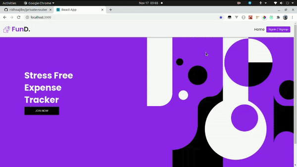

# Welcome to FunD!
<p  align="center"></p>

# Description
**FunD** is an easy interface application to many people, also has some features to make user not input repeatedly for those expense that do repeat payment. <br>
**FunD** App can help people who struggles to control, and keep on track for their financial expenses.


# Demo
<p  align="center"></p>

# Flowchart
```mermaid
graph LR
A((Start)) -- yes --> B{Have an account?}
B -- no --> C(register)
C --> D((access_token))
B -- yes --> E(Login)
E --> F{Forgot password?}
F -- no --> D
F -- yes --> G((Email varification))